# CampusRide 🚗💨
### AI-Powered Student Carpool Platform

**CampusRide** is a secure, smart, and responsive carpooling web application designed specifically for university and college student communities. It replaces chaotic, unorganized social media group chats (like WhatsApp or Discord) with a dedicated digital platform to schedule, negotiate, matching, and book shared student commutes.

---

## 🛠️ Technology Stack

- **Backend Framework:** Django (Python 3)
- **API Architecture:** Django REST Framework (DRF)
- **Database:** SQLite (SQL structure)
- **Frontend Architecture:** Single-Page Application (SPA) using Semantic HTML5 and Vanilla Javascript (ES6)
- **Design System:** Vanilla CSS featuring a premium Dark Mode Theme, Glassmorphism, and custom UI micro-animations
- **Mapping & Routing:** Leaflet.js with OpenStreetMap (OSM) and Nominatim Geocoding API
- **Iconography:** Remix Icons CDN

---

## 🌟 Core Modules

### 1. Unified Dashboard
- **Glassmorphic Design:** A sleek, responsive dashboard displaying quick statistics (Active Rides, My Bookings, and Verification Badge).
- **Dynamic Widgets:** The layout adapts to the logged-in role—hiding passenger widgets and expanding offerings to full width for drivers.

### 2. Multi-Role Access Control (RBAC) & ID Verification
- **Student Commuters:** Can act as both passengers (search/book/chat) and drivers (publish rides).
- **External Drivers:** Have a restricted interface focused solely on publishing rides and managing passenger requests. They cannot search or book other rides.
- **Admin Moderators:** Staff access to moderate reports, approve driver/student verification documents, and resolve emergency alerts.
- **Trust Checkmarks:** Student/Driver verification tags displayed across profiles to promote safety.

### 3. Smart Search, Routing & Matching
- **Interactive Leaflet Map:** Select coordinates on the map or search via location query.
- **Direction Guidance:** Collapsible guide panel calculating distances and turn-by-turn driving instructions.
- **Smart Match:** A route compatibility algorithm matching passenger pickup/drop-off points with active drivers' paths.

### 4. Create a Ride Flow (with AI Price Estimation)
- **Multi-Step Wizard:** Easy wizard separating Route, Vehicle details, and Pricing.
- **AI Estimator:** Recommends fair pricing per seat by parsing driving distance, vehicle type multiplier, rush hour coefficients, and student demand surges. Drivers can adjust this recommended value via a slider before publishing.
- **Recurring commutes:** Supports setting daily or weekly commuting schedules.

### 5. Messaging, Alerts & Notifications
- **In-App Messaging:** Secure chat interface to coordinate coordinates and pickup times.
- **Notifications Bell:** A dropdown alerts panel highlighting new booking requests, approvals, messages, and safety bulletins with quick-navigate links.

### 6. Safety & SOS Alerts
- **GPS SOS Emergency Trigger:** Passengers can trigger a distress alert in one click.
- **Admins Notification:** Logs GPS coordinates, maps location, active ride details, and student emergency contacts directly on the Admin panel for immediate safety dispatch.

---

## 🔄 User Workflows & Journeys

```mermaid
graph TD
    subgraph Student Passenger Journey
        S1[Sign Up as Student] --> S2[Submit Student ID Card Details]
        S2 --> S3[Wait for Admin Verification Badge]
        S3 --> S4[Search Available Rides / Smart Match]
        S4 --> S5[Initiate In-App Chat with Driver]
        S5 --> S6[Request Seat Booking]
        S6 --> S7[Approve & Join Commute]
        S7 --> S8{Emergency?}
        S8 -- Yes --> S9[Click SOS Button to Dispatch coordinates]
        S8 -- No --> S10[Complete Commute & Leave Rating/Review]
    end

    subgraph External Driver Journey
        D1[Sign Up as External Driver] --> D2[Submit License & Plate Details]
        D2 --> D3[Admin Approval Required]
        D3 --> D4[Create Ride w/ Route & Schedule]
        D4 --> D5[AI Pricing recommendation & manual slider adjustment]
        D5 --> D6[Publish Ride & Wait for Booking Requests]
        D6 --> D7[Accept/Reject passenger requests]
        D7 --> D8[Commence Commute]
    end
```



### Detailed Workflows

#### 1. Passenger Workflow
1. **Account Setup & Trust:** The student registers, uploads student card credentials under the **ID Verification** page, and gains a verified safety badge once approved.
2. **Find a Commute:** Uses the **Find Rides** search bar. Alternatively, they select pickup and drop-off markers directly on the map and click **Smart Match** to find optimal overlay rides.
3. **Coordinating & Booking:** Opens a chat with the host to negotiate schedules, then requests a seat reservation. Once approved, their booking ticket status changes to `APPROVED`.
4. **Commute Safety:** During the trip, if any hazard occurs, the passenger triggers the **SOS protocol**, which locks their location and alerts security admins. Upon arrival, they rate the driver (1-5 stars).

#### 2. Driver Workflow
1. **Onboarding:** Registers as a student commuter or external driver. External drivers must submit their commercial driving license and vehicle registration, and wait for moderator approval before publishing rides.
2. **Publish Wizard:** Fills out the multi-step form. 
   - **Step 1:** Defines pickup/drop-off names and tags map coordinates.
   - **Step 2:** inputs vehicle model, license plate, and seats.
   - **Step 3:** Review the base fare, traffic coefficients, and recommended price. Bumps the price slider to set final seat pricing and publishes the ride.
3. **Passenger Coordination:** Receives notifications for incoming requests. Manages bookings under the **My Bookings** page (approves or declines seats). Messages passengers to coordinate meeting points.

#### 3. Admin Moderation Workflow
1. **Verification Queue:** Inspects uploaded student/driver credentials, verifying or rejecting profiles.
2. **Safety Moderation:** Resolves complaints and reviews filed user reports, moderating users if necessary.
3. **Emergency Dispatch:** Monitors active safety alarms, accesses clickable Google Maps pins for distressed GPS coordinates, contacts emergency safety numbers, and closes alerts when resolved.

---

## 🚀 Installation & Local Launch

### Prerequisites
- Python 3.10 or higher installed.

### Setup Instructions

1. **Clone the Repository & Set Active Workspace:**
   ```bash
   git clone <your-repo-url>
   cd campus-ride
   ```

2. **Install Django & Required Dependencies:**
   ```bash
   pip install django djangorestframework
   ```

3. **Apply Database Migrations:**
   ```bash
   python manage.py migrate
   ```

4. **Seed Mock Database Commuters & Rides:**
   ```bash
   python seed_data.py
   ```

5. **Start the Development Server:**
   ```bash
   python manage.py runserver
   ```
   Open your browser and navigate to `http://127.0.0.1:8000/`.

---

## 🧪 Testing
To run the automated suite testing authentication, RBAC, view scopes, and pricing estimates:
```bash
python manage.py test
```
*(All 17 integration and model tests should complete successfully).*

---

## 👥 Seeded Login Credentials
For rapid manual verification, use the following pre-seeded test accounts:

| Role | Username | Password | Notes |
| :--- | :--- | :--- | :--- |
| **System Admin** | `admin` | `adminpass` | Full moderation queue access. |
| **Verified Driver** | `ext_driver_verified` | `driverpass` | Can publish rides immediately. |
| **Unverified Driver** | `ext_driver_unverified` | `driverpass` | Locked out of publishing until verified. |
| **Student Commuter** | `bob` | `bobpass` | Passenger / Commuter access. |
